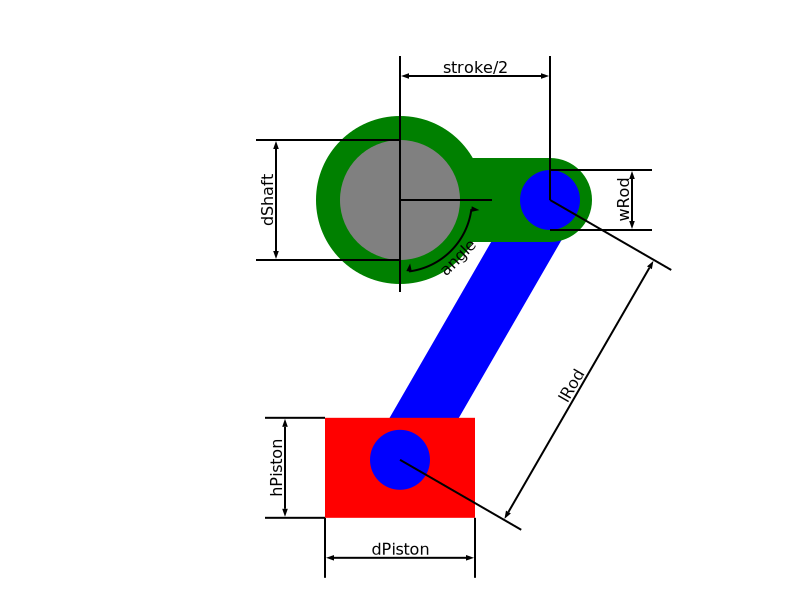

# Homework 1:  Incredible Machines
## Piston
This is a piston like device, to convert a rotation motion into a translation one

### Device definition

#### Parameters:
* _dShaft_: shaft's diameter 
* _stroke_: distance covered by the movement of the piston
* _lRod_: connecting rod's lenght
* _wRod_: connecting rod's width
* _hPiston_: piston's hight
* _dPiston_: piston's diameter
* _angle_: crank's rotation angle 

#### Definizione corpi e vincoli dei parametri:
* __SHAFT__: connection element to the rotation motion, defined by its diameter (_dShaft_).
* __MANOVELLA__: connects the crank to the connecting rod
    - Half the piston stroke (_stroke_) is defined as the crank's lenght. It's the distance between the shaft's axis and crank-connecting rod joint's axis.
    - The crank-connecting rod joint's diameter is equal to the connecting _wRod_.
    - The total crank's lenght depends on: _stroke_, _dShaft_, _wRod_. It's equal their sum plus two addition coupling terms for the joints with the shaft and the connecting rod.
    - The additional term for the connecting rod's joint is 1/5 _wRod_.
    - The additional term for the shaft's joint is 1/5 the _dShaft_.

    CONSTRAINTS:
    - The crank's lenght must be greater the sums of the two joints' radius.
* __CONNECTING ROD__: Connects crank and piston.
    - The connecting rod's lenght (_lRod_) is the distance between the axis of the crank and the piston joint.
    - The piston-connecting rod's joint is inside the piston, with an additional coupling term equal to 1/5 _wRod_.

    CONSTRAINTS:
    - _lRod_ must avoid interference between crank and piston in the lower dead point (_angle_ equal to 180°). 
    - _wRod_ can't be lower than 1/6 _lRod_.
    - _wRod_ can't be greater than _dShaft_.
* __PISTON__: connection element to the translation motion.

    CONSTRAINTS:
    - Piston's diameter and lenght (_dPiston_ e _hPiston_) must ensure the additional coupling term for the connecting rod joint, so they cant be lower than 7/5 _wRod_.
* __ANGOLO__: crank's rotation angle (_angle_) in degrees.

P.S. The coupling term is an additional portion of material around the whole joint edge.

Example image: 

### Command line parameters
* -h 

