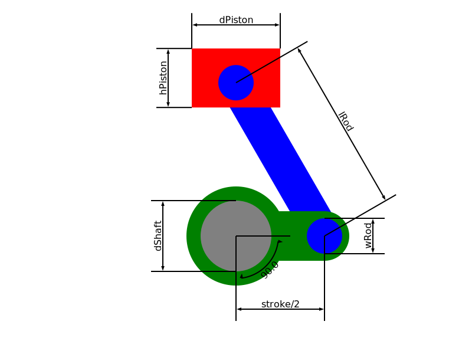

# Homework 1:  Incredible Machines
## Piston
This is a piston like device, to convert a rotation motion into a translation one

### Device definition

#### Parameters:
* `dShaft`: shaft's diameter 
* `stroke`: distance covered by the movement of the piston
* `lRod`: connecting rod's lenght
* `wRod`: connecting rod's width
* `hPiston`: piston's hight
* `dPiston`: piston's diameter
* `angle`: crank's rotation angle 

#### Definizione corpi e vincoli dei parametri:
* __SHAFT__: connection element to the rotation motion, defined by its diameter (`dShaft`).
* __CRANK__: connects the crank to the connecting rod
    - Half the piston stroke (`stroke`) is defined as the crank's lenght. It's the distance between the shaft's axis and crank-connecting rod joint's axis.
    - The crank-connecting rod joint's diameter is equal to the connecting `wRod`.
    - The total crank's lenght depends on: `stroke`, `dShaft`, `wRod`. It's equal their sum plus two addition coupling terms for the joints with the shaft and the connecting rod.
    - The additional term for the connecting rod's joint is 1/5 `wRod`.
    - The additional term for the shaft's joint is 1/5 the `dShaft`.

    CONSTRAINTS:
    - The crank's lenght must be greater the sums of the two joints' radius.
* __CONNECTING ROD__: Connects crank and piston.
    - The connecting rod's lenght (`lRod`) is the distance between the axis of the crank and the piston joint.
    - The piston-connecting rod's joint is inside the piston, with an additional coupling term equal to 1/5 `wRod`.

    CONSTRAINTS:
    - `lRod` must avoid interference between crank and piston in the lower dead point (`angle` equal to 180°). 
    - `wRod` can't be lower than 1/6 `lRod`.
    - `wRod` can't be greater than `dShaft`.
* __PISTON__: connection element to the translation motion.

    CONSTRAINTS:
    - Piston's diameter and lenght (`dPiston` e `hPiston`) must ensure the additional coupling term for the connecting rod joint, so they cant be lower than 7/5 `wRod`.
* __ANGLE__: crank's rotation angle (`angle`) in degrees.

P.S. The coupling term is an additional portion of material around the whole joint edge.

Example image: 

### Command line parameters
-h: show the helper as follow:
    Command format: `./mainentry -i importPath -e/-eq cxShaft cyShaft exportPath -p {params}`
    * `-i` import a device from the file with path `importPath`.
    * `-e` export a device on the file with path `exportPath`. The device is taken from:
        - an imported file called with the option `-i` (prioritized action).
        - the one crated with the params passed after the option `-p` (ignoerd if `-i` is called).
        `cxShaft`, `cyShaft` are the coordinates of the shaft's center on the SVG draw.
    * `-eq` export a device with quotes on the file with path `exportPath` (options as before).
    * `-p` followed by the params of the device to be exported (can't be called if `-e` or `-eq` isn't called before).
        Params: `dShaft stroke lRod wRod hPiston dPiston angle`(defult value 0) (for details see README).
    More following params will be ignored 

------

## Motor
The objective is to implement a simple representation of a motor.

### Machine definition
The motor is made by multiple structs called cylinder. Each cylinder is made by one piston and two camValve.

#### Cylinder struct:
* `piston`: pointer to piston (LBAMTTdevice).
* `valveSx`: pointer to camValve, it's the left valve.
* `valveDx`: pointer to camValve, it's the right valve.

#### Motor struct:
* `n`: number of cylinders.
* `cylinders`: array of pointers to cylinders.
* `angle`: motor shaft's angle.
* `offset`: array of double, angle offset of each cylinder with respect to the motor's shaft

#### Parameters:
Using these parameters, multiple Cylinders are intialized and stored into the array of the struct motor:
* `n`: number of cylinders of the motor
* `bore`: cylinder's bore
* `displacement`: motor's total displacement
* `angle`: motor shaft's angle
Depending on `n`, the array `offset` is created with different values. 

#### Constraints:
* __n__: can't be grater than four (to define `offset` easier)
* __bore__: It's equal the `dPiston`. Considering a car's motor, the `bore` /`stroke` ratio must be between 0.7 and 2.4 ([Stroke ratio](https://en.wikipedia.org/wiki/Stroke_ratio)); this set a limit to the `stroke`. The lower bound for the `bore` is set to 60.
  
  Depending on `n`, there is a cap on the `bore` value to allow the image to fit in the bounds. The caps are:

| n  | cap |
|---|---|
| 1  | 384  |
| 2  | 384  |
| 3  | 200  |
| 4  | 150  |

* __displacement__: from the displacement is possible to get the `stroke` of the single piston knowing that: 
  
        _displacement_ = _bore_2 * PI * _stroke_ * _n_

    To assure that the image fits in the bounds, the maximum value of the `stroke` is 160, turning into a cap on the displacement.

#### Offset and valve angle
Depending on `n`, the offset are set as follow:

| n  | offset | link |
|---|---|---|
| 1  | 0 |    |
| 2  | 0-360 |  [Straight-twin engine](https://en.wikipedia.org/wiki/Straight-twin_engine)  |
| 3  | 0-240-480 |  [Straight-three engine](https://en.wikipedia.org/wiki/Straight-three_engine)  |
| 4  | 0-180-540-360 |  [Straight-four engine](https://en.wikipedia.org/wiki/Straight-four_engine)  |

The cylinder's angle is defined from 0 to 720 degrees for a four-stroke engine. The camshafts moving the valves rotate half the speed of the motor's shaft, so their angle is defined from 0 to 360 degrees and the rotation speed is halved also. The cycle is defined as follow:
* pistonAngle = 0 -> start compression: both valve closed
* pistonAngle = 180 -> explosion: both valve closed
* pistonAngle = 360 -> start expelling: valve Dx open, valve Sx closed
* pistonAngle = 540 -> start aspiration: valve Sx open, valve Dx closed
To follow this scheme, the left valve has an offset of PI*3/4 between the piston (starting to close) and the right valve has an additional offset of PI/4, so it starts to open earlier.